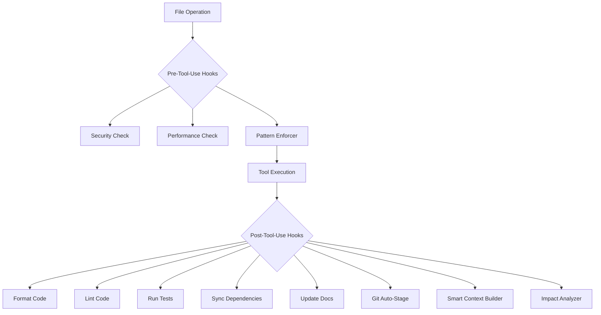

# 🤖 Claude Code Project Template

**Supercharge your development workflow with 14 production-ready hooks and professional tooling!**

[](https://github.com/anthropics/claude-project-template)
[](LICENSE)
[](#hooks-system)

## ⚡ Quick Install

### 🚀 One-Line Installation

```bash
curl -fsSL https://raw.githubusercontent.com/anthropics/claude-project-template/main/bootstrap.sh | bash
```

### 📋 Manual Installation

```bash
# Clone the template
git clone https://github.com/anthropics/claude-project-template.git
cd claude-project-template

# Install into your project
./bootstrap.sh --dir /path/to/your/project
```

### 🎯 Installation Options

```bash
# Interactive installation (recommended)
./bootstrap.sh

# Auto-detect and install
./bootstrap.sh --mode auto

# Install only hooks (for existing Claude Code users)
./bootstrap.sh --mode hooks-only

# Install for specific project type
./bootstrap.sh --type node    # node, python, go, java, rust
```

---

## 🎯 What You Get

### 🔧 **14 Production-Ready Hooks**

#### **Core Development (5 hooks)**
- **format-code.sh** - Auto-formatting for 10+ languages
- **lint-code.sh** - Enhanced linting with frontend support  
- **run-tests.sh** - Intelligent test detection and execution
- **sync-dependencies.sh** - Auto package management
- **security-check.sh** - Prevents dangerous patterns

#### **Productivity Enhancement (5 hooks)**
- **update-docs.sh** - API documentation auto-updates
- **git-auto-stage.sh** - Smart staging of formatted files
- **cleanup-imports.sh** - Unused import removal and sorting
- **performance-check.sh** - Large file and operation warnings
- **backup-file.sh** - Automatic file backup before edits

#### **Large-Codebase Specialized (4 hooks)**
- **smart-context-builder.sh** - Builds intelligent context for files
- **dependency-impact-analyzer.sh** - Impact severity analysis
- **pattern-enforcer.sh** - Enforces consistency patterns
- **import-optimizer.sh** - Converts relative to absolute imports

### 💼 **Professional Command Suite**
- **32 essential commands** with keyboard shortcuts
- **15+ workflow prompts** for common development tasks
- **MCP tool integrations** for enhanced productivity
- **Project-specific configurations** based on detected tech stack

### 🧠 **Knowledge Management**
- **Neo4j integration** for persistent project knowledge
- **Smart context building** based on file relationships
- **Impact analysis** to understand change consequences
- **Pattern learning** from team coding practices

---

## 🏗️ Architecture

### 📂 Template Structure

```
your-project/
├── CLAUDE.md                 # Project context for Claude
├── CLAUDE.local.md           # Local configuration (not in git)
└── .claude/
    ├── hooks/                # 14 production-ready hooks
    │   ├── post-tool-use/    # Hooks that run after file operations
    │   ├── pre-tool-use/     # Hooks that run before operations
    │   ├── utils/            # Shared utilities and Neo4j integration
    │   └── logs/             # Hook execution logs
    ├── prompts/              # Professional workflow prompts
    ├── context/              # Generated context files
    ├── knowledge/            # Neo4j knowledge cache
    ├── commands.json         # 32 professional commands
    ├── hooks.json            # Hook configuration
    └── settings.template.json # Claude Code settings template
```

### 🔄 Hook Execution Flow



---

## 🚀 Getting Started

### 1. **Install the Template**

Choose your installation method:

```bash
# Quick install in current directory
curl -fsSL https://raw.githubusercontent.com/anthropics/claude-project-template/main/bootstrap.sh | bash

# Custom installation
./bootstrap.sh --mode interactive --type auto
```

### 2. **Activate the Hooks**

```bash
# Set environment variables
source .claude/setup-env.sh

# Restart Claude Code to activate hooks
# (The hooks will now run automatically!)
```

### 3. **Customize for Your Project**

Edit `CLAUDE.md` with your project details:
- Project name and description
- Architecture overview
- Current development priorities
- Team conventions and patterns

### 4. **Verify Installation**

```bash
# Test the hooks system
./.claude/test-hooks.sh

# Test a specific hook
./.claude/hooks/post-tool-use/format-code.sh test.js
```

---

## 🎯 Use Cases

### 👥 **For Teams**
- **Consistent code quality** across all developers
- **Automated pattern enforcement** for large codebases
- **Knowledge sharing** through documented patterns
- **Reduced onboarding time** with standardized workflow

### 🏢 **For Enterprise**
- **Scalable to 100+ developers** and thousands of files
- **Impact analysis** before deploying changes
- **Security validation** prevents dangerous patterns
- **Compliance support** through audit trails

### 🚀 **For Individual Developers**
- **Productivity boost** with automatic formatting and testing
- **Learning assistance** through smart context building
- **Best practices** enforced automatically
- **Professional workflow** without manual setup

---

## 🔧 Configuration

### 🎛️ **Hook Configuration**

Customize hooks by editing `.claude/hooks.json`:

```json
{
  "PostToolUse": [
    {
      "matcher": "Edit|Write|MultiEdit",
      "hooks": [
        {
          "command": ".claude/hooks/post-tool-use/format-code.sh",
          "timeout": 30000
        }
      ]
    }
  ]
}
```

### 🎨 **Project Customization**

Update `CLAUDE.md` with:
- Your project's tech stack and architecture
- Development priorities and current focus
- Team conventions and coding standards
- API routes, database models, component patterns

### 🔐 **Environment Variables**

Essential configuration in `.claude/setup-env.sh`:

```bash
# Required
export PROJECT_NAME="your-project-name"
export CLAUDE_LOGS_DIR=".claude/hooks/logs"

# Optional enhancements
export GITHUB_PERSONAL_ACCESS_TOKEN="ghp_your_token"
export POSTGRES_CONNECTION_STRING="postgresql://..."
```

---

## 📊 Hook Reference

### 🔧 **Core Development Hooks**

| Hook | Purpose | Languages | When It Runs |
|------|---------|-----------|--------------|
| `format-code.sh` | Auto-format code | 10+ languages | After file edit |
| `lint-code.sh` | Code linting & validation | Multi-language | After file edit |
| `run-tests.sh` | Intelligent test execution | Multi-framework | After source change |
| `sync-dependencies.sh` | Auto package management | npm, pip, cargo, go | After package file change |
| `security-check.sh` | Security validation | All files | Before file edit |

### 🚀 **Large-Codebase Hooks**

| Hook | Purpose | Best For | Output |
|------|---------|----------|--------|
| `smart-context-builder.sh` | Build file context | Large projects | `.claude/context/` files |
| `dependency-impact-analyzer.sh` | Change impact analysis | Enterprise codebases | Impact severity & suggestions |
| `pattern-enforcer.sh` | Consistency enforcement | Team development | Violation reports |
| `import-optimizer.sh` | Import organization | Complex projects | Optimized import statements |

### ⚡ **Performance & Quality**

| Hook | Purpose | Triggers | Benefits |
|------|---------|----------|----------|
| `performance-check.sh` | Large file warnings | Before operations | Prevents slowdowns |
| `git-auto-stage.sh` | Smart staging | After formatting | Clean commits |
| `cleanup-imports.sh` | Remove unused imports | After code edits | Cleaner codebase |
| `update-docs.sh` | Auto-update docs | API changes | Current documentation |

---

## 🎓 Advanced Usage

### 🔄 **Custom Hook Development**

Create your own hooks:

```bash
# Create new hook
cat > .claude/hooks/post-tool-use/my-custom-hook.sh << 'EOF'
#!/bin/bash
source "$(dirname "$0")/../utils/common.sh"
init_hook "my-custom-hook"

# Your custom logic here
log_info "Running custom hook for $1"

finalize_hook "my-custom-hook" "completed"
EOF

# Make executable
chmod +x .claude/hooks/post-tool-use/my-custom-hook.sh

# Add to hooks.json configuration
```

### 🧠 **Neo4j Knowledge Integration**

Store and retrieve project knowledge:

```bash
# Store file context
python3 .claude/hooks/utils/neo4j_mcp.py store_file_context "src/api.js" "express,cors" "router,middleware"

# Get context for file
python3 .claude/hooks/utils/neo4j_mcp.py get_context "src/api.js"

# Store impact analysis
python3 .claude/hooks/utils/neo4j_mcp.py store_impact_analysis "src/api.js" '{"count": 15}'
```

### 🎯 **Performance Optimization**

For large projects:

```bash
# Disable resource-intensive hooks temporarily
export CLAUDE_HOOKS_SKIP="smart-context-builder,dependency-impact-analyzer"

# Adjust hook timeouts in .claude/hooks.json
# Set specific hooks for specific file patterns
```

---

## 📈 Metrics & Monitoring

### 📊 **Hook Performance**

Monitor hook execution:

```bash
# View hook logs
tail -f .claude/hooks/logs/hooks.log

# Hook execution time analysis
grep "completed" .claude/hooks/logs/hooks.log | tail -20

# Hook success rate
grep -c "SUCCESS\|FAIL" .claude/hooks/logs/hooks.log
```

### 🔍 **Knowledge Graph Analytics**

Analyze your codebase:

```bash
# View stored knowledge
ls .claude/knowledge/

# Context generation statistics
find .claude/context -name "*.md" | wc -l

# Impact analysis history
grep "impact" .claude/knowledge/*_impact.json
```

---

## 🆘 Troubleshooting

### 🔧 **Common Issues**

**Hooks not running:**
```bash
# Check Claude Code is restarted
# Verify environment variables
source .claude/setup-env.sh

# Test hook manually
./.claude/hooks/post-tool-use/format-code.sh test.js
```

**Permission errors:**
```bash
# Fix hook permissions
find .claude -name "*.sh" -exec chmod +x {} \;
find .claude -name "*.py" -exec chmod +x {} \;
```

**Missing tools:**
```bash
# Install recommended tools
npm install -g prettier eslint
pip install black isort autoflake
go install golang.org/x/tools/cmd/goimports@latest
```

### 🔍 **Debug Mode**

Enable detailed logging:

```bash
export CLAUDE_HOOKS_DEBUG=true
export CLAUDE_LOGS_DIR=".claude/hooks/logs"

# Run operation and check logs
tail -f .claude/hooks/logs/hooks.log
```

---

## 🤝 Contributing

### 🛠️ **Development Setup**

```bash
# Clone the repository
git clone https://github.com/anthropics/claude-project-template.git
cd claude-project-template

# Test hooks
./.claude/test-hooks.sh

# Test bootstrap script
./bootstrap.sh --mode auto --dir /tmp/test-project
```

### 📝 **Contributing Guidelines**

1. **Hook Development**: Follow the existing hook pattern with `common.sh` utilities
2. **Testing**: All hooks must pass the test suite
3. **Documentation**: Update README and hook comments
4. **Backwards Compatibility**: Maintain compatibility with existing installations

### 🐛 **Reporting Issues**

When reporting issues, include:
- Claude Code version
- Project type and structure
- Hook logs from `.claude/hooks/logs/hooks.log`
- Steps to reproduce

---

## 📄 License

MIT License - see [LICENSE](LICENSE) file for details.

---

## 🎉 Success Stories

> *"Reduced our code review time by 60% with automatic formatting and pattern enforcement."*  
> — Senior Developer, Tech Startup

> *"The impact analysis saved us from a breaking change that would have affected 200+ files."*  
> — Engineering Manager, Enterprise Team

> *"Setup time for new developers went from 2 days to 30 minutes."*  
> — DevOps Lead, SaaS Company

---

## 🔗 Links

- **Documentation**: [Full Documentation](https://docs.anthropic.com/claude-code)
- **Examples**: [Example Projects](examples/)
- **Community**: [Discord Community](https://discord.gg/claude-code)
- **Issues**: [GitHub Issues](https://github.com/anthropics/claude-project-template/issues)

---

**Ready to supercharge your development workflow?**

```bash
curl -fsSL https://raw.githubusercontent.com/anthropics/claude-project-template/main/bootstrap.sh | bash
```

**Happy coding with Claude! 🚀**