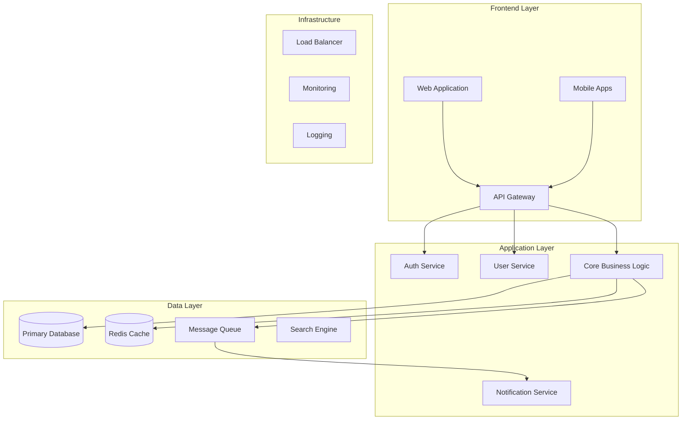

# 🏗️ System Architecture Design Prompt

## Context
You are designing a comprehensive system architecture that balances technical excellence with business requirements. This design should be scalable, maintainable, secure, and aligned with modern architectural principles.

## Architecture Design Process

### Phase 1: Requirements Analysis

#### 1.1 Functional Requirements
Analyze and document:
- **Core Features**: Primary system capabilities
- **User Workflows**: End-to-end user journeys
- **Business Rules**: Domain-specific logic and constraints
- **Integration Points**: External systems and APIs
- **Data Requirements**: Storage, processing, and retrieval needs

#### 1.2 Non-Functional Requirements
Define measurable targets:
- **Performance**: Response times, throughput, latency
- **Scalability**: User growth, data volume projections
- **Availability**: Uptime targets (99.9%, 99.99%)
- **Security**: Authentication, authorization, encryption
- **Compliance**: Regulatory requirements (GDPR, HIPAA, etc.)

#### 1.3 Constraints & Assumptions
Document limitations:
- **Technical Constraints**: Existing systems, technology stack
- **Resource Constraints**: Team size, budget, timeline
- **Operational Constraints**: Deployment environment, maintenance windows
- **Business Constraints**: Licensing, vendor lock-in considerations

### Phase 2: High-Level Architecture

#### 2.1 Architectural Style
Choose appropriate pattern:
```yaml
Microservices:
  when: 
    - Multiple teams
    - Independent scaling needs
    - Technology diversity required
  
Monolithic:
  when:
    - Small team
    - Rapid prototyping
    - Simple domain model

Event-Driven:
  when:
    - Real-time requirements
    - Loose coupling needed
    - Async processing

Serverless:
  when:
    - Variable load
    - Cost optimization priority
    - Minimal ops overhead
```

#### 2.2 System Components


### Phase 3: Detailed Component Design

#### 3.1 API Layer
Design principles:
```yaml
API Design:
  style: RESTful / GraphQL / gRPC
  versioning: URI versioning (v1, v2) / Header versioning
  authentication: JWT / OAuth2 / API Keys
  rate_limiting: 
    - Per user: 1000 req/hour
    - Per IP: 100 req/minute
  documentation: OpenAPI 3.0 / GraphQL Schema
```

Example API structure:
```
/api/v1/
├── /auth
│   ├── POST   /login
│   ├── POST   /logout
│   ├── POST   /refresh
│   └── GET    /profile
├── /users
│   ├── GET    /         (list users)
│   ├── POST   /         (create user)
│   ├── GET    /{id}     (get user)
│   ├── PUT    /{id}     (update user)
│   └── DELETE /{id}     (delete user)
└── /resources
    ├── GET    /         (paginated list)
    ├── POST   /         (create)
    ├── GET    /{id}     (retrieve)
    ├── PATCH  /{id}     (partial update)
    └── DELETE /{id}     (soft delete)
```

#### 3.2 Data Architecture
```yaml
Database Strategy:
  primary_db: 
    type: PostgreSQL
    purpose: Transactional data, ACID compliance
    
  cache_layer:
    type: Redis
    purpose: Session storage, frequent queries
    ttl: 1 hour default
    
  search_engine:
    type: Elasticsearch
    purpose: Full-text search, analytics
    
  message_queue:
    type: RabbitMQ / Kafka
    purpose: Async processing, event streaming
    
  object_storage:
    type: S3 / MinIO
    purpose: Files, images, documents
```

#### 3.3 Security Architecture
```yaml
Security Layers:
  network:
    - TLS 1.3 for all communications
    - VPC with private subnets
    - WAF for application protection
    
  application:
    - Input validation on all endpoints
    - SQL injection prevention
    - XSS protection
    - CSRF tokens
    
  authentication:
    - Multi-factor authentication
    - Password policies
    - Account lockout mechanisms
    
  authorization:
    - Role-based access control (RBAC)
    - Attribute-based access control (ABAC)
    - Principle of least privilege
    
  data:
    - Encryption at rest (AES-256)
    - Encryption in transit (TLS)
    - PII data masking
    - Audit logging
```

### Phase 4: Scalability & Performance

#### 4.1 Scaling Strategy
```yaml
Horizontal Scaling:
  web_tier:
    - Auto-scaling groups
    - Target CPU: 70%
    - Min instances: 2
    - Max instances: 20
    
  app_tier:
    - Container orchestration (Kubernetes)
    - Service mesh (Istio)
    - Pod autoscaling
    
  data_tier:
    - Read replicas
    - Sharding strategy
    - Connection pooling

Caching Strategy:
  levels:
    - CDN: Static assets, 24hr TTL
    - Application: Redis, 1hr TTL
    - Database: Query cache, 5min TTL
  
  invalidation:
    - Event-based cache busting
    - TTL-based expiration
    - Manual invalidation endpoints
```

#### 4.2 Performance Optimization
```yaml
Optimization Techniques:
  database:
    - Proper indexing strategy
    - Query optimization
    - Connection pooling
    - Prepared statements
    
  application:
    - Lazy loading
    - Pagination (limit: 100)
    - Batch processing
    - Async operations
    
  frontend:
    - Code splitting
    - Image optimization
    - Compression (gzip/brotli)
    - Resource minification
```

### Phase 5: Deployment Architecture

#### 5.1 Environment Strategy
```yaml
Environments:
  development:
    - Local Docker setup
    - Mock external services
    - Test data seeders
    
  staging:
    - Production-like setup
    - Reduced resources
    - Anonymized prod data
    
  production:
    - Multi-AZ deployment
    - Blue-green deployments
    - Canary releases
    - Rollback capability
```

#### 5.2 CI/CD Pipeline
```yaml
Pipeline Stages:
  1. Code Commit:
     - Linting
     - Unit tests
     - Security scan
     
  2. Build:
     - Compile/transpile
     - Create artifacts
     - Build containers
     
  3. Test:
     - Integration tests
     - Performance tests
     - Security tests
     
  4. Deploy:
     - Deploy to staging
     - Smoke tests
     - Deploy to production
     - Health checks
     
  5. Monitor:
     - Performance metrics
     - Error tracking
     - User analytics
```

### Phase 6: Monitoring & Observability

#### 6.1 Monitoring Stack
```yaml
Metrics:
  infrastructure:
    - CPU, Memory, Disk, Network
    - Container metrics
    - Database connections
    
  application:
    - Request rate
    - Error rate
    - Response time
    - Business metrics
    
Logging:
  structure: JSON formatted
  levels: ERROR, WARN, INFO, DEBUG
  retention: 30 days hot, 1 year cold
  
Tracing:
  tool: Jaeger / Zipkin
  sampling: 1% in production
  
Alerting:
  channels: Email, Slack, PagerDuty
  severity: Critical, High, Medium, Low
```

## Architecture Documentation

### 6.1 Architecture Decision Records (ADR)
```markdown
# ADR-001: Database Selection

## Status
Accepted

## Context
Need reliable, scalable database for user and transaction data.

## Decision
Use PostgreSQL as primary database.

## Consequences
- Strong ACID compliance
- Excellent JSON support
- Mature ecosystem
- Requires DBA expertise
```

### 6.2 Component Documentation
```yaml
Component: User Service
Purpose: Manages user accounts and profiles
Technology: Node.js, Express
Database: PostgreSQL
Cache: Redis
Dependencies:
  - Auth Service: Token validation
  - Notification Service: Welcome emails
API:
  - GET /users: List users
  - POST /users: Create user
  - GET /users/{id}: Get user details
  - PUT /users/{id}: Update user
  - DELETE /users/{id}: Soft delete user
```

## Success Criteria

Your architecture should:
1. **Meet all functional requirements** with clear component mapping
2. **Achieve non-functional targets** with measurable metrics
3. **Scale horizontally** to handle 10x growth
4. **Maintain high availability** (99.9%+ uptime)
5. **Ensure security** at all layers
6. **Support easy deployment** and rollback
7. **Enable monitoring** and debugging
8. **Document decisions** clearly
9. **Consider cost** optimization
10. **Plan for disaster** recovery

## Deliverables Checklist

- [ ] High-level architecture diagram
- [ ] Component interaction diagrams
- [ ] Data flow diagrams
- [ ] API documentation
- [ ] Database schema
- [ ] Security threat model
- [ ] Deployment architecture
- [ ] Monitoring strategy
- [ ] Capacity planning
- [ ] Cost estimation
- [ ] Technology choices with rationale
- [ ] Architecture Decision Records
- [ ] Risk assessment
- [ ] Migration strategy (if applicable)